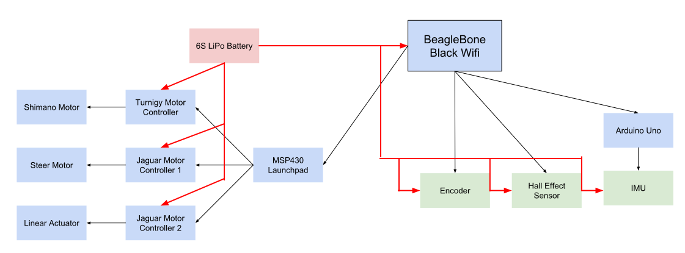
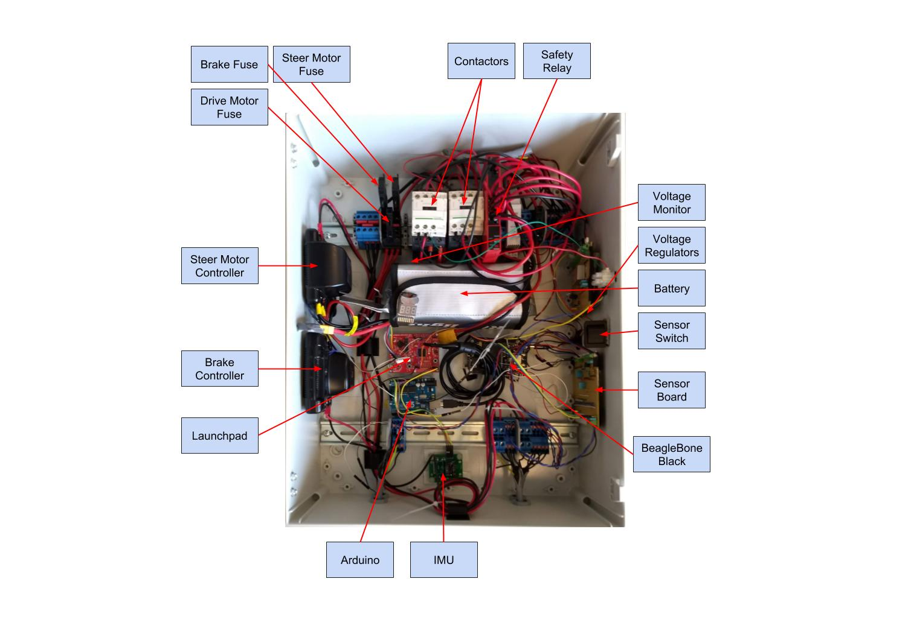
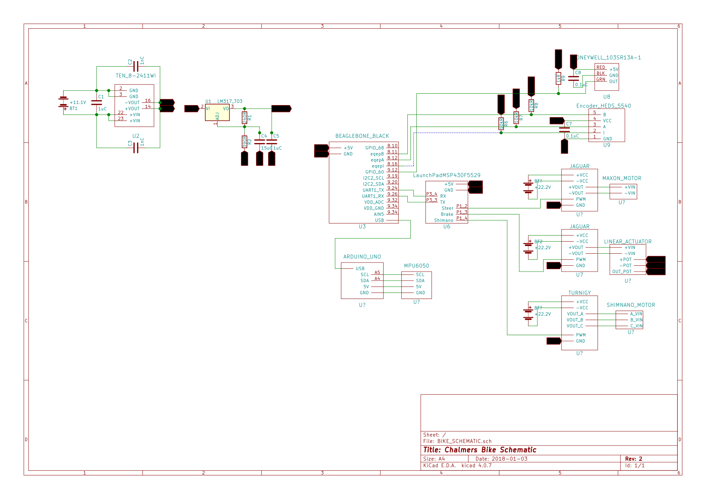
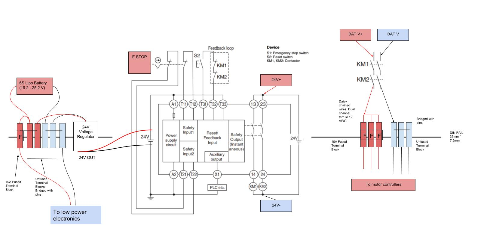

Menu:

* [Project Overview](https://chalmersbike.github.io/pages/overview.html)

* [Electronic Design](https://chalmersbike.github.io/pages/electronics.html)

* [Programming](https://chalmersbike.github.io/pages/programming.html)

* [Mechanical Design](https://chalmersbike.github.io/pages/mechanical.html)

* [Control](https://chalmersbike.github.io/pages/control.html)

* [How-To Guides](https://chalmersbike.github.io/pages/howto/)

* [Bugs and Troubleshooting](https://chalmersbike.github.io/pages/bugs.html)

---


<!--ts-->
   * [Overview:](#overview)
   * [Components](#components)
      * [Enclosure Overview](#enclosure-overview)
      * [Schematic](#schematic)
      * [Pin Configuration](#pin-configuration)
         * [Beaglebone](#beaglebone)
         * [Arduino Uno](#arduino-uno)
         * [MSP430](#msp430)
      * [Safety Relay](#safety-relay)
   * [Steering Motor Configuration](#steering-motor-configuration)
   * [Longitudinal Motor configuration](#longitudinal-motor-configuration)
   * [Future Work](#future-work)

<!-- Added by: Boaz Ash, at: 2018-08-10T16:46+02:00 -->

<!--te-->

# Overview:

The bike has several electronics components that will be detailed below.




# Components
* **BeagleBone Black Wireless** - this is the computer that implements the controller, communicates with all the sensors and  controls the actuators

* **Launchpad MSP430** (EXP430F5529LP) - this is a real-time microcontroller that is responsible for generating the PWM pulses for motor controller. It is connected to the BeagleBone via serial which means that only one character can be sent at a time. The benefit of a real-time microcontroller is its speed and reliability. If instead the BeagleBone was generating the PWM signals and it had to service an interrupt, the signal may be affected which could result in loss of motor control

* **Hall Effect Sensor** (Honeywell 103SR13A-1) - this sensor is used to measure the forward velocity of the bike. A set of five neodymium magnets were mounted on the rear wheel and the Hall Effect sensor generates a pulse when they travel past it

* **IMU** (Inertial Measurement Unit, MPU6050 mounted on a PCB designed by Niclas Hillborg) - this is a 9 axis sensor that is used to obtain the roll angle and rate of rotation of the bike

* **Encoder** (HEDS5540) - this is the encoder for the steering motor. It has 3 channels and can determine the position of the motor shaft with very high precision

* **Jaguar Motor Controller** (MDLBDC24) - This controller converts the PWM signals from the Launchpad into voltage across the motor terminals. It allows for forward and reverse rotation.

* **Arduino Uno** - This is used to read the values from the IMU and to apply the complementary filter. It replaced the old configuration where the IMU was directly connected to the Beaglebone using the I2C protocol, this was too slow for real-time operation.

* **6S Lipo Battery** - Used to power the system.

## Enclosure Overview

Here you can see an overview of the enclosure and the layout of all the components.




## Schematic

To interface all of these sensors and provide the correct voltages, several other components were required. The connections and components are detailed in the schematic below.




The major components are:
* **Traco Power DC/DC Converter** (TEN 8-2411WI) - This takes our battery voltage as an input and outputs 5V DC.

* **3.3V Linear Regulator** (LM317_T03) - Provides 3.3V to power our sensors

## Pin Configuration
These are the pins to use for the external connections.

### Beaglebone

Please refer to [Beaglebone Cape Pins](http://beagleboard.org/static/images/cape-headers.png) for a diagram

* `P8.11`: Encoder CH.B
* `P8.12`: Encoder CH.A
* `P9.12`: Hall Sensor
* `P9.24`: UART TX (MSP430 RX P3.4)
* `P9.26`: UART RX (MSP430 TX P3.3)
* `USB connection`: To Arduino Uno

### Arduino Uno
Please refer to [Arduino Reference Board](https://www.arduino.cc/en/Reference/Board) for a diagram


* `A4`: IMU_MPU6050 SDA
* `A5`: IMU_MPU6050 SCL
* `GND`: IMU_MPU6050 GND
* `5V`: IMU_MPU6050 5V
* `USB`: Beaglebone

### MSP430
Please refer to [MSP430F5529 Reference](http://energia.nu/img/LaunchPadMSP430F5529.jpg) for a diagram

* `P1.2`: Jaguar Steering Motor Controller
* `P1.3`: Jaguar Brake Motor Controller
* `P1.4`: Turnigy Velocity Motor Controller

## Safety Relay

An Omron G9SE-201 Safety Relay has been included in the enclosure to shutdown all motor power in case of runaway conditions. This is a category 4 emergency stop setup.

There are several components required:
* S1: E-STOP button
* S2: Reset Switch
* KM1, KM2: **Schneider LC1D12BL 24VDC, 12A contactors**




The electrical setup was completed according to the [Omron manual for the safety relay: Section 5, Page 2](https://www.omron.com.au/data_pdf/mnu/g9se-201_-401_-221-t__inst-4022078-4c.pdf?id=3419).

# Steering Motor Configuration

We are using a *Maxon DCX32L* Motor (24 V, 110 W). 

The motor is connected to a *GPX 32 HP* Planetary Gearhead (111:1 reduction).

[Motor parameters can be found here](https://www.maxonmotor.com/medias/sys_master/root/8825437356062/17-EN-86.pdf)

[Gearbox parameters can be found here](https://www.maxonmotor.com/medias/sys_master/root/8825471565854/17-EN-341.pdf)

The motor is connected to a [Maxon ESCON Module 50/5 motor controller](https://www.maxonmotor.com/medias/sys_master/root/8818447482910/409510-ESCON-50-5-Hardware-Reference-En.pdf). 

The ESCON configuration parameters were set as follows:

**Motor Data**
```
Speed Constant = 350 RPM/V
Thermal Time Constant Winding = 42.2 s
Max Permissible Speed = 8000 RPM
Nominal Current = 4.12 A
Max Output Current = 10 A
```

**Controller Mode of Operation:** 

`Current Control`

**Set value**

RC Servo input:
```
1 ms = -4.12 A
2 ms = +4.12 A
```


# Longitudinal Motor configuration

We are using a *Shimano STePS* motor on this bike. It is a brushless DC motor and it is rated at 250W. It has an encoder signal but it is not being used as that requires advanced reverse engineering.

**Motor Parameters:**
```
Internal resistance = 0.1 Ohm
Inductance = 195 uH
```

The motor is connected to a [Maxon ESCON Module 50/4 EC-S motor controller](https://www.maxonmotor.com/medias/sys_master/root/8818449317918/446925-ESCON-Module-50-4-EC-S-Hardware-Reference-En.pdf). 

Configuring the controller took a bit of trial and error. The settings that have been used are as follows:

**Motor Data**
```
Speed Constant = 814.2 RPM/V
Thermal Time Constant Winding = 4.0 s
Number of Pole Pairs = 1
```

**System Data**
```
Max. Permissible Speed = 20000 RPM
Nominal Current = 4 A
Max. Output Current Limit = 10 A
```

**Set value**

RC Servo input:
```
1 ms = 0 RPM
2 ms = 20000 RPM
```

**Minimal Speed / Stall Behaviour**
```
Minimal speed = 3600 RPM

Calculated as follows: 

n_min = (Vcc * Kn) / 7

where: 

Vcc = 25 V and Kn = 1000 RPM/V
```


**Expert Tuning - Speed controller**

Startup Loop:
```
Startup Current = 8 A
Synchronous Startup Acceleration = 100 Hz/s
```

# Future Work

* Add an inline fuse between the battery and the first connector.

* The electrical setup for the bike is very messy and it’s begging for a redesign that is more accessible, robust and neater. A PCB for this project would make it much more professional. Current electrical upgrades include:

    * An external power supply input be nice so that we can test the electronics without having the bike around or constantly recharging the batteries

    * A voltage and current monitor for the batteries to prevent discharging them beyond their safe limits. This would also allow us to monitor power consumption and identify areas for future improvement

    * The cables all terminate with screw terminals which makes rewiring very annoying. It is also very hard to identify signal cables. The new circuit should have better connectors

    * The sensors are housed in broken out modules that could probably purchased as surface mount modules and get mounted directly to the PCB

    * There are no LEDs to indicate functionality of the circuit

    * There is no reverse polarity or over-voltage protection (relevant for future circuit upgrades)

    * The BeagleBone cannot have any voltage applied to its pins before it is properly on. We need to design a buffer wait until the BeagleBone is ready

    * The voltage regulators should be swapped to DIN rail mounted modules. This eliminates one custom designed protoboard inside the enclosure. We need 5V and 3.3V rails.
