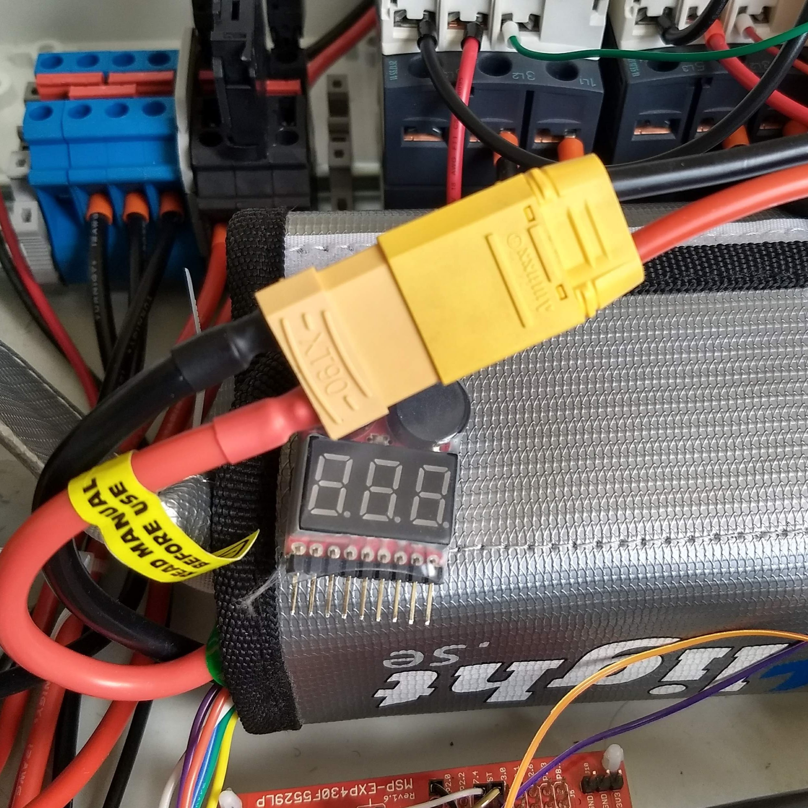
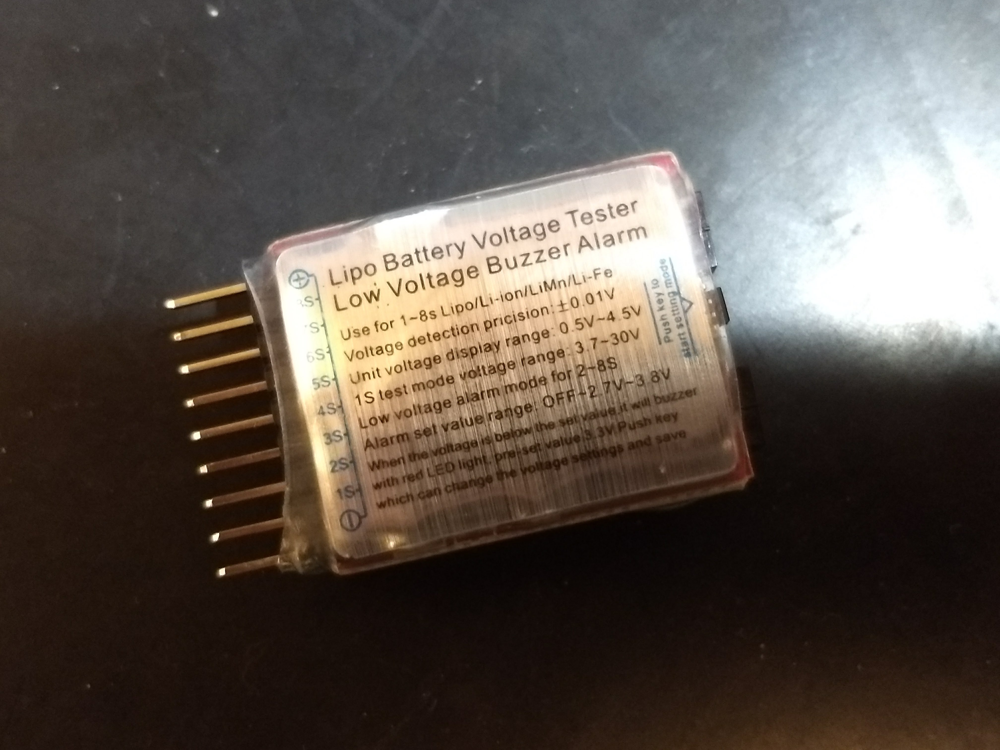
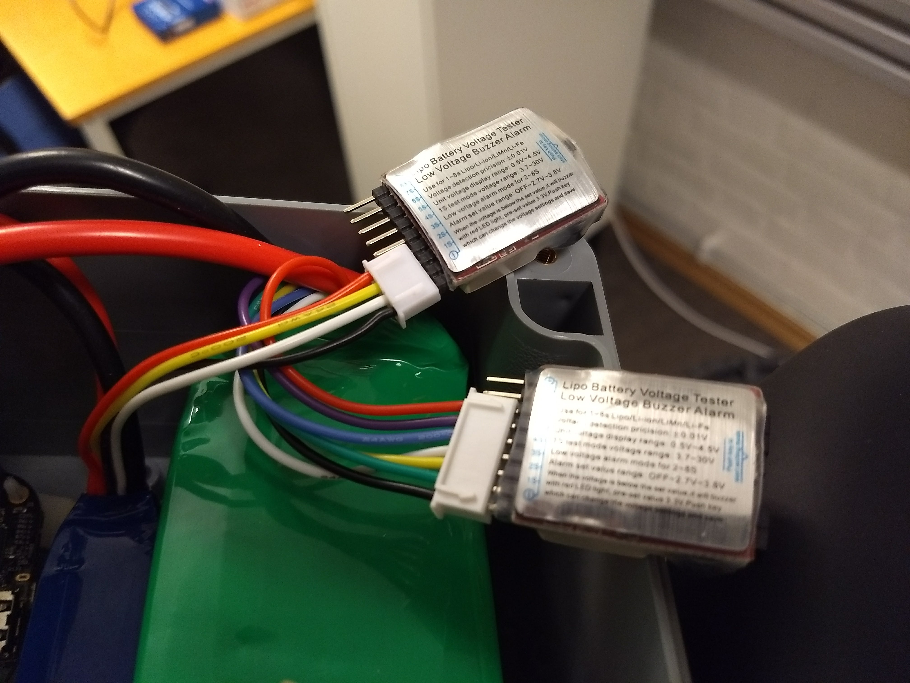
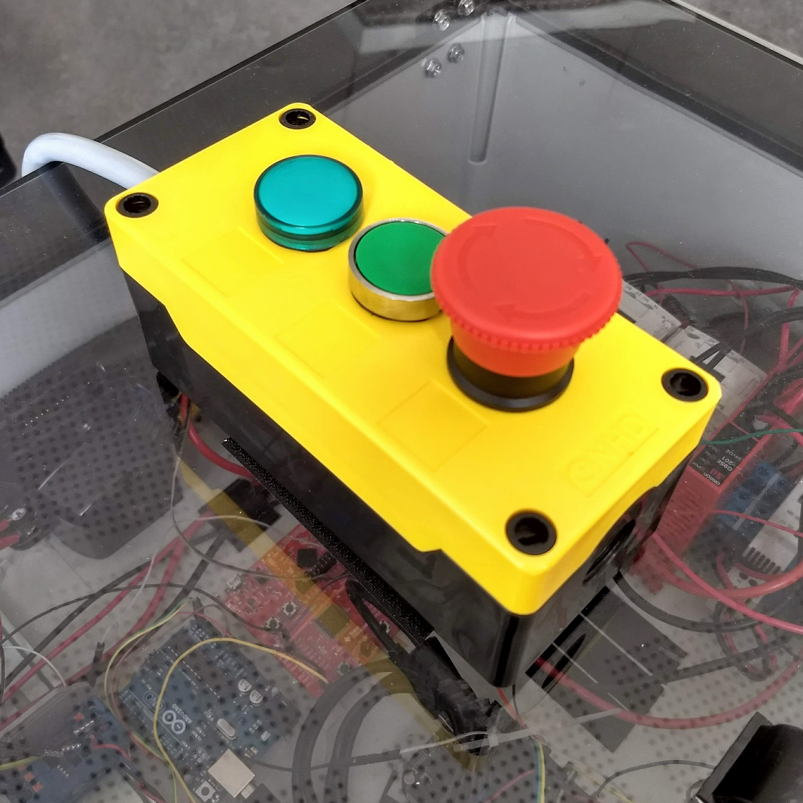
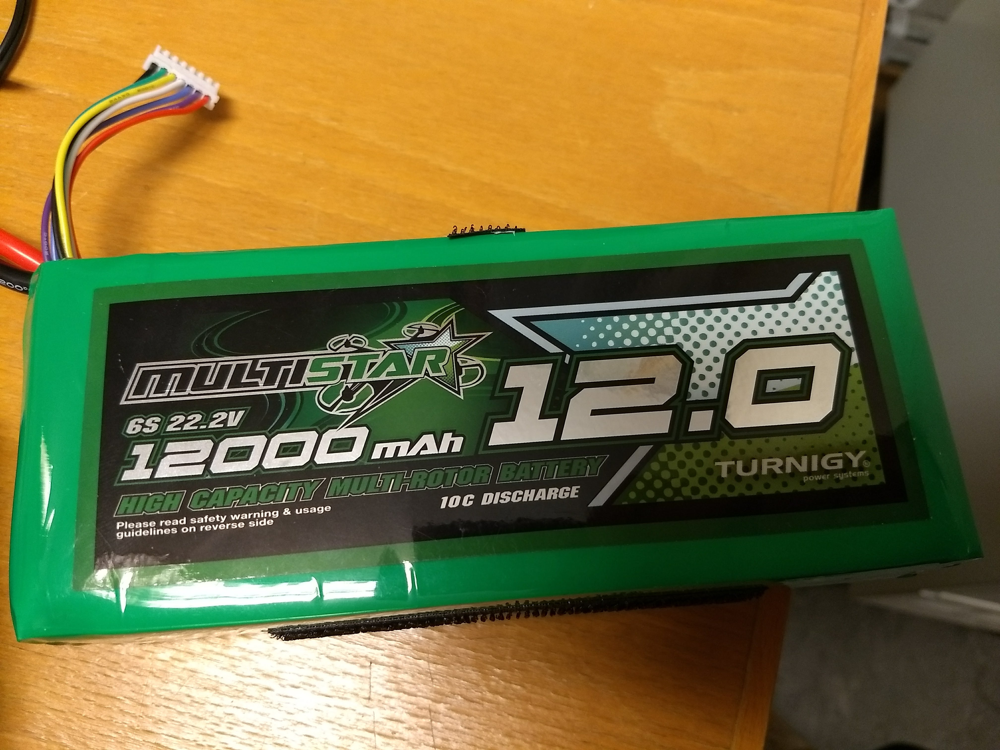
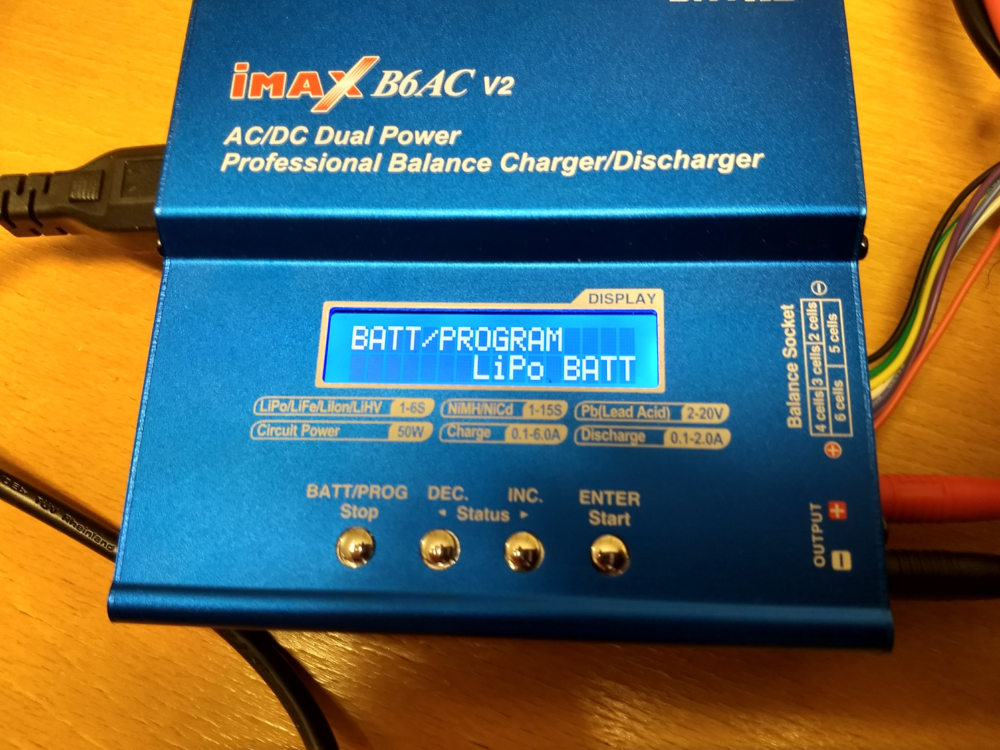
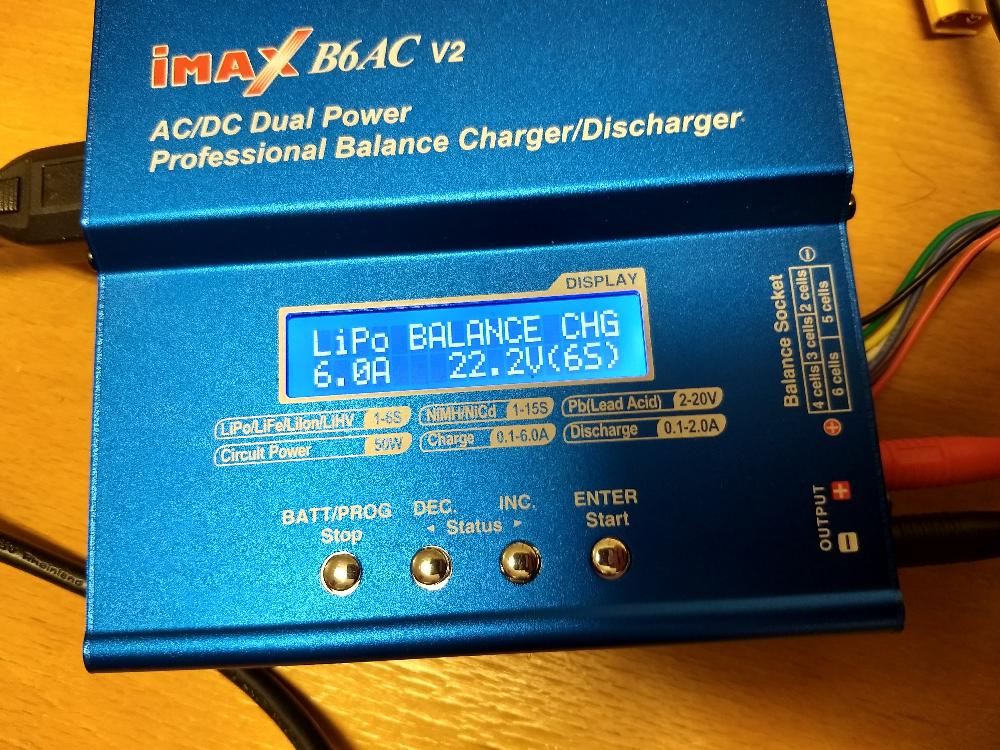
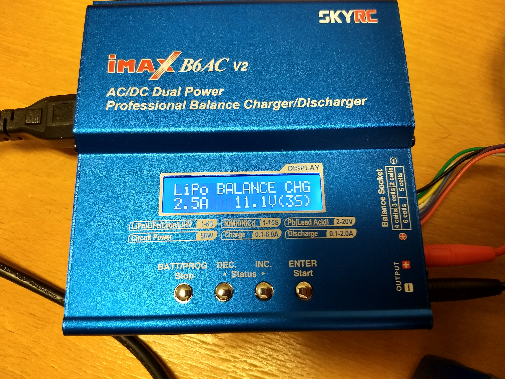

Table of Contents
-----------------
<!--ts-->
   * [How to turn the system on/off](#how-to-turn-the-system-onoff)
   * [How to stop in an emergency](#how-to-stop-in-an-emergency)
      * [Press the E-STOP button](#press-the-e-stop-button)
   * [How to charge the batteries](#how-to-charge-the-batteries)
         * [To charge the batteries:](#to-charge-the-batteries)

<!-- Added by: Boaz Ash, at: 2018-08-10T16:47+02:00 -->

<!--te-->

# How to turn the system on/off

The diagram below shows all the components required to turn on the bike:

Battery connection detail:

| Powering **ON** |
|-------------|
| Connect the battery to the system |
| Wait until you see the heartbeat blink on the BeagleBone LEDs. `**This is very important as applying voltage to the BeagleBone pins before it is ready can damage the board` |
| Turn on the sensor power switch |
| Connect the battery voltage monitors |

| Powering **OFF** |
|-------------|
| Turn off the sensor power switch |
| Turn off the BeagleBone |
| Disconnect the battery |
| Disconnect the battery voltage monitors `**Make sure to pull by holding the connectors and not to pull the wires` |

If you will be using the bike for an extended period of time (>1h) it is important to connect the battery voltage monitors to prevent discharging the batteries beyond their safe voltage levels.

|Battery Voltage Monitor | Battery Voltage Monitors in place |
:-------------------------:|:-------------------------:
  |  

Connect the negative end labelled with a MINUS (-) symbol to the black wire of the battery JST-XH balance connector (pictured on the right). The buzzer will beep when you first connect it and it will beep continuously (to warn you!) if the voltage drops beyond the set limit. If it starts beeping, disconnect immediately and charge the battery.

# How to stop in an emergency

The bike has a category 4 emergency stop system. When you press the emergency stop button (E-STOP) all the motors will have their power cut. The Beaglebone and circuitry will still be powered so data is not corrupted.

## Press the E-STOP button

# How to charge the batteries

LiPo batteries are very dangerous and very sensitive. Be nice to them. They can catch fire, explode, burn things or electrocute you. Do not short circuit the batteries. Do not charge with the wrong settings. Do not let the voltage drop beyond the safe cell voltage. **A LiPo cell should NEVER be discharged below 3.0V.**

We have one battery in use at the moment:

| MultiStar High Capacity 12000mAh 6S 10C Multi-Rotor Lipo Pack |
|-------------------------|
|

|
| 6 cells |

This is our charger. It is able to balance charge our batteries which ensures no individual cell gets over/under charged.

### To charge the batteries:

1. Connect the banana plugs into the output terminals of the charger. Please take care of the polarity
2. Connect the other end of the cable with the banana plugs (the XT60 or XT90 connectors) to the battery.
3. Select the LiPo BATT program (pictured above). This is done using the middle two buttons (DEC/INC) to scroll through the menu and the right button (ENTER) to select.
4. In the LiPo Batt menu, select the LiPo BALANCE CHG option
5. Press ENTER
   * If you are charging the 6S battery
      * Increase the current to 6.0A and press ENTER
      * Select 6S

   * If you are charging the 3S battery
      * Increase the current to 2.5A and press ENTER
      * Select 3s

6. Press and hold ENTER. The verification screen will appear
7. Verify that you did it right
8. Press ENTER to start charging

The charger will stop when the battery is charged. It will also stop if it exceeds the temperature limit or goes beyond 120 minutes of charging.
