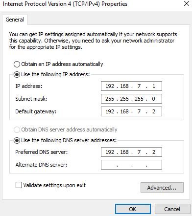

[Home](https://chalmersbike.github.io)

Table of Contents
-----------------
<!--ts-->
   * [How to connect to the BeagleBone](#how-to-connect-to-the-beaglebone)
   * [How to start an ssh session with the BeagleBone](#how-to-start-an-ssh-session-with-the-beaglebone)
   * [How to upload code to the BeagleBone from Pycharm](#how-to-upload-code-to-the-beaglebone-from-pycharm)
   * [How to run code on the BeagleBone](#how-to-run-code-on-the-beaglebone)
   * [How to download results from the BeagleBone](#how-to-download-results-from-the-beaglebone) 
   * [How to share internet with the BeagleBone via USB on Windows](#how-to-share-internet-with-the-beaglebone-via-usb-on-windows)
   * [How to connect the BeagleBone to a WiFi Hotspot](#how-to-connect-the-beaglebone-to-a-wifi-hotspot) 


<!-- Added by: Boaz Ash, at: 2018-08-10T16:47+02:00 -->

<!--te-->

-----------------

# How to connect to the BeagleBone

1. Power on the BeagleBone

2. Connect to the BeagleBone. This can be done by:

  a. Plugging in a micro-USB cable to the BeagleBone

  OR
    
  b. Connecting to the BeagleBone WiFi access point. Depending on which BeagleBone you are using you will see one of the following access points:
  
  ```
    BBB1 SSID = BeagleBone-63C9

    BBB2 SSID = BeagleBone-132D
```

# How to start an ssh session with the BeagleBone

1. [Connect to the BeagleBone](#how-to-connect-to-the-beaglebone)

2. Open an SSH client like [Putty](https://www.chiark.greenend.org.uk/~sgtatham/putty/) or [MobaXterm](https://mobaxterm.mobatek.net/) (recommended)

3. Start an ssh session

  a. If you connected using USB connect to `192.168.7.2`

  b. If you connected using WiFi connect to `192.168.8.1`

  Finally enter the details to connect:

  Username: `debian`

  Password: `temppwd`

  Port: `22`

# How to upload code to the BeagleBone from Pycharm

1. You will need to ensure that Pycharm is configured to connect to the BeaglBone. If this has not been done please follow these instructions:

Navigate to Tools -> Deployment -> Configuration
---
For a WiFi connection:

   **Under the Connection Tab:**
   
   SFTP Host: `192.168.8.1`
   Port: `22`
   Root path: `/home/debian`
   User name: `debian`
   Password: `temppwd`

   **Under the Mapings Tab:**
   Deployment path on server: `/chalmersbike`
   
For a USB connection:

   **Under the Connection Tab:**
   
   SFTP Host: `192.168.7.2`
   Port: `22`
   Root path: `/home/debian`
   User name: `debian`
   Password: `temppwd`

   **Under the Mapings Tab:**
   Deployment path on server: `/chalmersbike`

2. In the Project view window of Pycharm (normally on the left), right click on the `src` folder.

Select `Deployment --> Upload To` and select the appropriate BeagleBone configuration. This will upload all of the modified and new files to the Beaglebone.

<p align="center"></p>

# How to run code on the BeagleBone

1. Start an ssh session with the BeagleBone

2. This guide will assume that the login script executed properly and that your terminal is starting from the 'virtual environment' and you are in the `src` folder. This can be verified by checking that your terminal cursor is preceded by something resembling:

    `(chalmersbike-zI2YTWPT) debian@beaglebone:~/chalmersbike/src$`

    where 

    `(chalmersbike-zI2YTWPT)` is the virtual environment

    `debian@beaglebone` is the user and device name

    `~/chalmersbike/src` is the current folder

  3. Navigate to the folder containing your code:

      `cd foldercontainingcode`

4. Run script

    bash script:
    `./myscript.sh`

    python script:
  `python myscript.py`

####  Example: we have a testing script in the testing/rear_motor folder

    cd testing/rear_motor
    
    python rear_motor.py

# How to download results from the BeagleBone

In Pycharm:

1. Select the following from the menu: `View -> Tool Windows -> Remote Host`

2. On the right hand side of the screen you will see the Remote Host window. Navigate to the folder where your results are saved. This will likely be in a subfolder of `chalmersbike/src/`

3. Right click on the file you are interested in and select `Download from here`

4. On the left hand side of the screen are the local files on your computer. Find the local folder that corresponds to the folder where you downloaded the file from in the Remote Host window.

5. (Optional) It is best if you move the file out of the git project folders and do data analysis eleswhere. The easiest way to do this is to right click on the file and select `Show in Explorer`. Then you can move the file to your folder of choice.

# How to share internet with the BeagleBone via USB on Windows

1. Plug the micro-USB cable into the BeagleBone

2. Open Network Connections in the control panel. 

    Alternatively enter this into the run window: `ncpa.cpl`

3. Right click on the BeagleBone network adaptor and choose `Properties`. The correct adaptor can be identified by its device name, look for:  `Linux USB Ethernet/RNDIS Gadget` 

<p align="center"></p>


4. Modify the settings so they match this image and press OK.

<p align="center"></p>

5. Close the Properties window

6. Right click on your primary network adaptor and choose `Properties`.

7. Select the `Sharing` tab and modify the settings so they match this image and press OK. If prompted to change the IP of the Beaglebone, press Yes. You may have to repeat step 4 to get it working.

<p align="center"></p>

8. SSH into the Beaglebone and run the script `usb_internet.sh` located in the root directory of this repo.


# How to connect the BeagleBone to a WiFi Hotspot

After you have started a WiFi hotspot within range of the Beaglebone, you can connect to it as follows:

`sudo connmanctl`

Enter password `temppwd`

`scan wifi`

`services`

You should now see your access point listed, for example, my access point appears as `BOAZ_WIFI2           wifi_f45eab3f63c6_424f415a5f5749464932_managed_psk`

For this example, I need to run the following command

`agent on`

`connect wifi_f45eab3f63c6_424f415a5f5749464932_managed_psk`

Then you will need to enter the password for the access point

You should see a confirmation that says `Connected wifi_f45eab3f63c6_424f415a5f5749464932_managed_psk`

You can also verify that you are online by typing: `services` again. You should see `AO` to the left of the accesspoint name.

More info:

The symbols in the output above are: '*' favorite (saved) network, 'A' autoconnectable, 'O' online and 'R' ready. If no letter is shown in the O/R column, the network is not connected. In addition, temporary states include 'a' for association, 'c' configuration and 'd' disconnecting. When any of these three letters are showing, the network is in the process of connecting or disconnecting.

https://wiki.archlinux.org/index.php/ConnMan

https://01.org/connman/documentation
