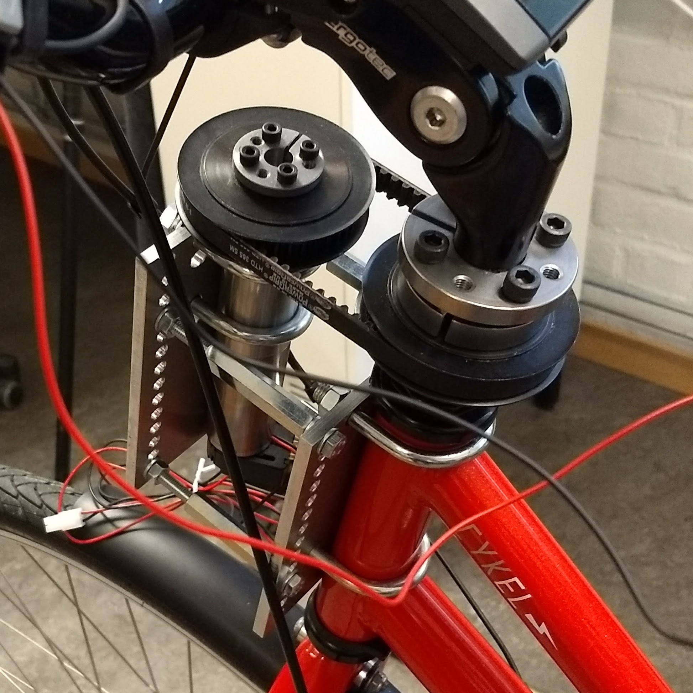

Menu:

* [Project Overview](https://chalmersbike.github.io/pages/overview.html)

* [Electronic Design](https://chalmersbike.github.io/pages/electronics.html)

* [Programming](https://chalmersbike.github.io/pages/programming.html)

* [Mechanical Design](https://chalmersbike.github.io/pages/mechanical.html)

* [Control](https://chalmersbike.github.io/pages/control.html)

* [How-To Guides](https://chalmersbike.github.io/pages/howto/)

* [Bugs and Troubleshooting](https://chalmersbike.github.io/pages/bugs.html)

---

<!--ts-->
   * [Steering Motor](#steering-motor)
      * [Mounting](#mounting)
   * [Magnets for Hall Sensor](#magnets-for-hall-sensor)

<!-- Added by: Boaz Ash, at: 2018-08-10T16:47+02:00 -->

<!--te-->

# Steering Motor

The steering motor used is a **Maxon DCX 32 L 24V**. 

The motor is connected to a planetary gearbox of type **Maxon GPX 32** with a reduction of **111:1**.

The output shaft of the motor/gearbox combination has a diameter of 10 mm. The bike stem has a diameter of 34.56 mm.

## Mounting

We designed a custom mount that allows the motor and gearbox to be mounted parallel to the steering axis. The shaft of the motor and the bike stem have belt pulleys attached and they are linked with a toothed belt. 

# Magnets for Hall Sensor

There are five magnets equally spaced around the circumference of the rear wheel. The wheel diameter was measured to be 0.695 m. 
