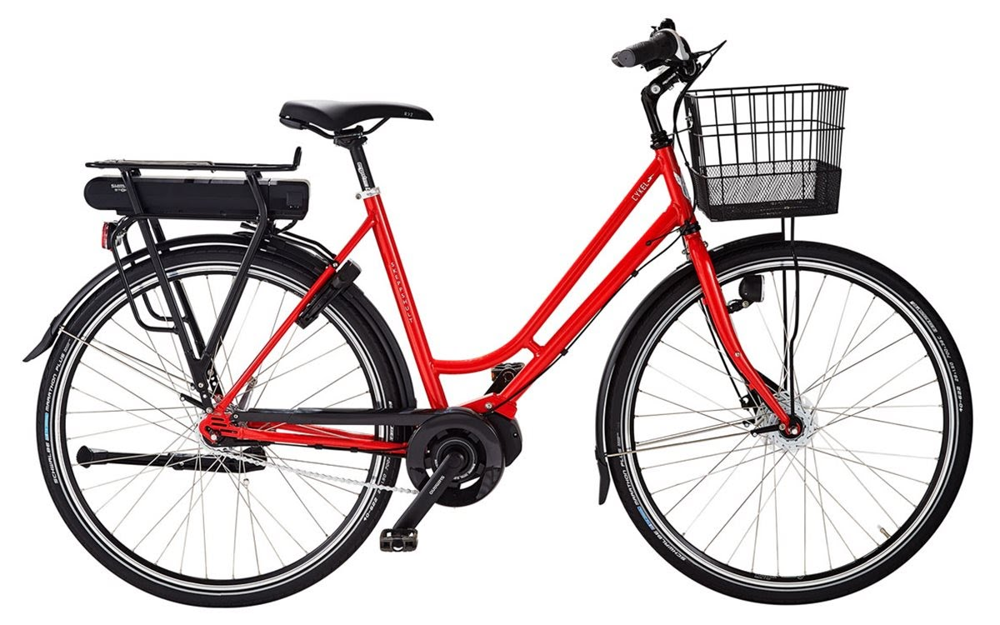

Menu:

* [Project Overview](https://chalmersbike.github.io/pages/overview.html)

* [Electronic Design](https://chalmersbike.github.io/pages/electronics.html)

* [Programming](https://chalmersbike.github.io/pages/programming.html)

* [Mechanical Design](https://chalmersbike.github.io/pages/mechanical.html)

* [Control](https://chalmersbike.github.io/pages/control.html)

* [How-To Guides](https://chalmersbike.github.io/pages/howto/)

* [Bugs and Troubleshooting](https://chalmersbike.github.io/pages/bugs.html)

---

# Project Overview

This document is a work in progress with the eventual hope that the project details and procedures will be posted here in their entirety.

## Project Goals:

The goal of this project is to develop an autonomous bicycle that can follow a predefined path predictably and consistently. Once finished, the bike will be used to evaluate autonomous vehicle safety systems and improve their ability to detect cyclists.

## Current Status:

The project can be structured into three main groups: [Electronics](https://github.com/bababash/chalmersbike/wiki/Electronics), [Mechanical Design](https://github.com/bababash/chalmersbike/wiki/Mechanical-Design) and [Control](https://github.com/bababash/chalmersbike/wiki/Control). Please see those pages for more detailed information.

**In brief:-**

**What works:**
* A prototype bike has been developed with the necessary sensors and actuators functioning correctly.
* A bicycle model and controller have been developed and run in simulation.

**What doesn't:**
* The bike can't balance yet. A 3-state LQR controller has been developed but it requires tuning.

**What needs improvement:**
* The WiFi range of the current onboard computer (BeagleBone Black Wireless edition) is extremely limited and not suitable for tests.
* The size of the enclosure should be reduced.
* The circuitry should get a modular redesign with improved connectors.
* The current circuit doesn't allow battery voltage levels and current draw to be monitored.
